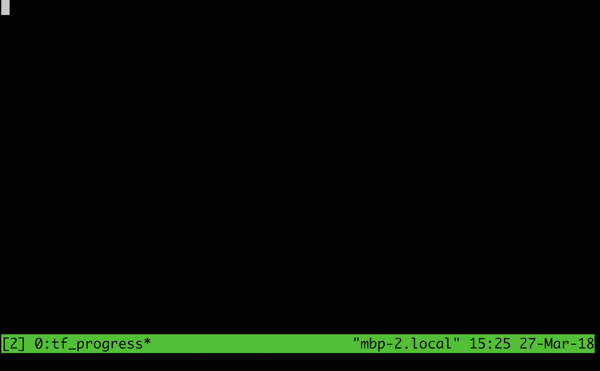

# TensorFlow Progress

## Introduction

The easy-to-use library for logging training progress of TensorFlow.

Now you can visualize the progress of machine learning jobs with [tf_progress](https://github.com/tobegit3hub/tf_progress).


## Installation

```
pip install tf_progress
```

## Usage

Run with the simple APIs and checkout more [examples](./examples/).

```
from tf_progress.tf_progress import TFProgress

progress = TFProgress(total_epoch_number=10, enable_print_progress_thread=True)

for i in range(10):
  progress.increase_current_epoch_number()
```

## APIs

Initialize the TFProgress object.

```
progress = TFProgress(total_epoch_number=10)
```

Set the total epoch number.

```
progress.set_total_epoch_number(10)
```

Update the current epoch number.

```
progress.increase_current_epoch_number()

progress.set_current_epoch_number(10)

progress.clear_current_epoch_number()
```

Print the progress status.

```
print(progress.get_current_progress())

progress.print_progress()

progress.start_print_progress_thread()
```

## Display Progress

Now it supports 4 types of displaying progress.

The default display type is `DISPLAY_TYPE_STDOUT_TEXT`.


The better one with progress bar is `DISPLAY_TYPE_STDOUT_BAR`.


The method to store progress in file is `DISPLAY_TYPE_LOCAL_FILE`.



The way to send progress to server is `DISPLAY_TYPE_HTTP_REQUEST`.

